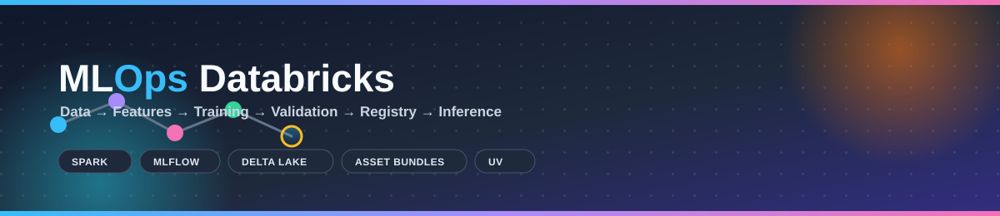
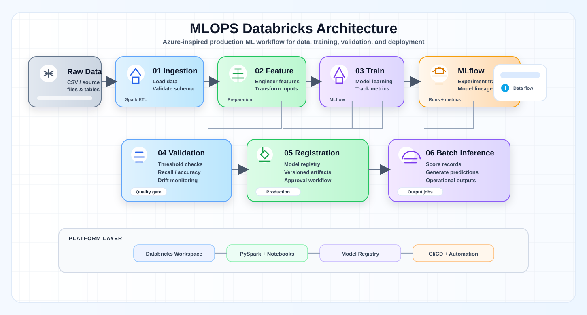
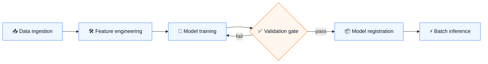
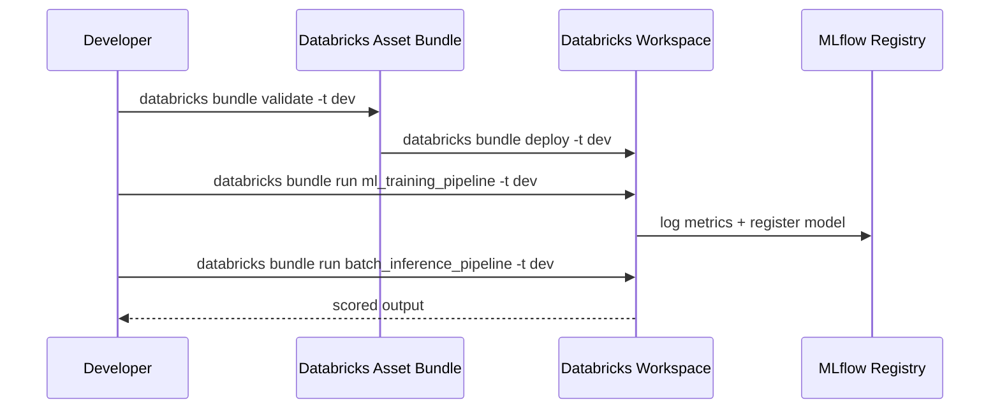

<p align="center">
  
</p>

<p align="center">
  
  
  
  
  
  
  
  
</p>

<p align="center">
  A compact, production-style Databricks MLOps workflow — data preparation, training, validation, registration, and batch inference — powered by <code>uv</code>, <code>pytest</code>, and Databricks Asset Bundles.
</p>

## 📑 Table of contents

- [Overview](#-overview)
- [Pipeline flow](#-pipeline-flow)
- [Project structure](#-project-structure)
- [Prerequisites](#-prerequisites)
- [Quick start](#-quick-start)
- [Testing](#-testing)
- [Local Spark dry run](#-local-spark-dry-run)
- [Databricks bundle usage](#-databricks-bundle-usage)
- [Configuration](#-configuration)
- [Dependency and tooling conventions](#-dependency-and-tooling-conventions)
- [Contributing](#-contributing)
- [References](#-references)

## 🔭 Overview



**Key capabilities:**

- 🧹 Spark-based data cleaning and auditing utilities
- 📊 ML metric logging with MLflow
- ⚙️ YAML-driven model configuration
- 🔁 Databricks notebook pipeline for ingestion, feature engineering, training, validation, registration, and inference
- ✅ Local test coverage and dry-run validation

## 🧬 Pipeline flow





## 🗂️ Project structure

<details>
<summary>Click to expand the full tree</summary>

```text
.
├── databricks.yml               # Databricks bundle configuration
├── pyproject.toml               # Single dependency and tool source of truth
├── README.md                    # Project documentation
├── config/
│   └── model_config.yaml        # Default model and training settings
├── deployment/
│   ├── deploy.sh
│   └── rollback.sh
├── src/
│   ├── models/
│   │   ├── __init__.py
│   │   └── model_config.py
│   ├── notebooks/
│   │   ├── 01_data_ingestion.py
│   │   ├── 02_feature_engineering.py
│   │   ├── 03_model_training.py
│   │   ├── 04_model_validation.py
│   │   ├── 05_model_registration.py
│   │   ├── 06_batch_inference.py
│   │   └── notebook_utils.py
│   └── utils/
│       ├── __init__.py
│       ├── data_utils.py
│       └── ml_utils.py
├── tests/
│   ├── test_data_utils.py
│   ├── test_ml_utils.py
│   └── test_model_config.py
├── htmlcov/                     # Coverage reports
├── coverage.xml                 # Coverage output
└── .venv/                       # uv virtual environment
```

</details>

## ✅ Prerequisites

| Requirement | Notes |
|---|---|
| `uv` | Python environment and dependency management |
| Python 3.10+ | Verified with 3.12 locally |
| Java 11 | Required for local PySpark runs on Windows |
| Databricks CLI | Workspace access for bundle deployment |

### Recommended local Spark setup on Windows

```powershell
$env:JAVA_HOME = 'C:\Program Files\Java\jdk-11'
$env:PATH = 'C:\Program Files\Java\jdk-11\bin;' + $env:PATH
$env:PYSPARK_PYTHON = (Resolve-Path .\.venv\Scripts\python.exe).Path
$env:PYSPARK_DRIVER_PYTHON = $env:PYSPARK_PYTHON
```

> **Tip:** without these variables PySpark may fail to launch its JVM gateway on Windows.

This is required for the Spark local dry run and DataFrame creation to work reliably on Windows.

## 🚀 Quick start

```bash
git clone <repo-url>
cd MLOPS-Databricks
uv sync --extra dev
```

Activate the environment when needed:

```powershell
.\.venv\Scripts\Activate.ps1
```

## 🧪 Testing

```powershell
$env:JAVA_HOME = 'C:\Program Files\Java\jdk-11'
$env:PATH = 'C:\Program Files\Java\jdk-11\bin;' + $env:PATH
$env:PYSPARK_PYTHON = (Resolve-Path .\.venv\Scripts\python.exe).Path
$env:PYSPARK_DRIVER_PYTHON = $env:PYSPARK_PYTHON
uv run pytest -q
```

✔️ Verified result for this repo: **15 tests passed** with **83.33% coverage**.

## 🔬 Local Spark dry run

```powershell
$env:JAVA_HOME = 'C:\Program Files\Java\jdk-11'
$env:PATH = 'C:\Program Files\Java\jdk-11\bin;' + $env:PATH
$env:PYSPARK_PYTHON = (Resolve-Path .\.venv\Scripts\python.exe).Path
$env:PYSPARK_DRIVER_PYTHON = $env:PYSPARK_PYTHON
uv run python -c "from pyspark.sql import SparkSession; s = SparkSession.builder.master('local[*]').appName('probe').getOrCreate(); print(s.version); print(s.createDataFrame([(1, None), (2, 'b')], ['id', 'value']).collect()); s.stop()"
```

## 📦 Databricks bundle usage

Validate the bundle:

```bash
databricks bundle validate -t dev
```

Deploy the bundle:

```bash
databricks bundle deploy -t dev
```

Run the jobs defined in the bundle:

```bash
databricks bundle run ml_training_pipeline -t dev
databricks bundle run batch_inference_pipeline -t dev
```

## 🔢 Pipeline stages

| # | Stage | Description |
|---|---|---|
| 1 | 📥 Data ingestion | Reads raw data and validates required fields |
| 2 | 🛠️ Feature engineering | Creates derived features for training |
| 3 | 🤖 Model training | Trains the selected model and logs metrics in MLflow |
| 4 | ✅ Model validation | Evaluates model quality against thresholds |
| 5 | 📦 Model registration | Registers the model in MLflow Model Registry |
| 6 | ⚡ Batch inference | Scores new data in batch mode |

## ⚙️ Configuration

Model and training settings are centralized in:

- [config/model_config.yaml](config/model_config.yaml)
- [src/models/model_config.py](src/models/model_config.py)

The repository keeps a single source of truth for Python dependencies and tooling in [pyproject.toml](pyproject.toml).

## 🧰 Dependency and tooling conventions

- Python environment and package installation: `uv`
- Test runner: `pytest`
- Coverage: configured in [pyproject.toml](pyproject.toml)
- Spark runtime: PySpark with Java 11 on Windows
- Databricks packaging: `databricks.yml` + bundle artifacts

## 🤝 Contributing

1. Create a feature branch.
2. Keep changes scoped and documented.
3. Add or update tests for behavior changes.
4. Run the local test suite before submitting a PR.
5. Keep docs in sync with code changes.

Example commands:

```powershell
uv run pytest -q
uv run pytest tests/test_data_utils.py -q
uv run flake8 src tests
```

## 🧹 Optimization notes

This repo was simplified to reduce repetition and keep one authoritative project config:

- consolidated dependency metadata into [pyproject.toml](pyproject.toml)
- removed duplicated install/setup metadata
- standardized test configuration and coverage thresholds
- kept a single operational README as the canonical documentation source

## 📚 References

- [Databricks Asset Bundles](https://docs.databricks.com/dev-tools/bundles/)
- [MLflow Documentation](https://mlflow.org/docs/latest/)
- [PySpark](https://spark.apache.org/docs/latest/api/python/)
- [Delta Lake](https://delta.io/)

---

<p align="center"><sub>Built for reproducible, testable Databricks MLOps pipelines.</sub></p>
